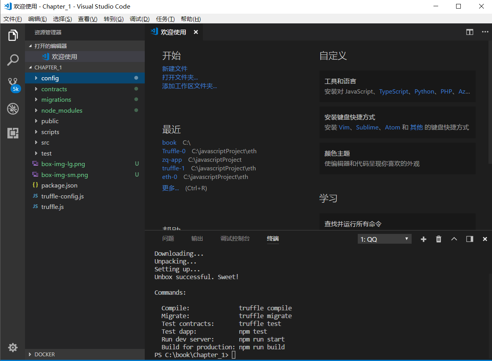
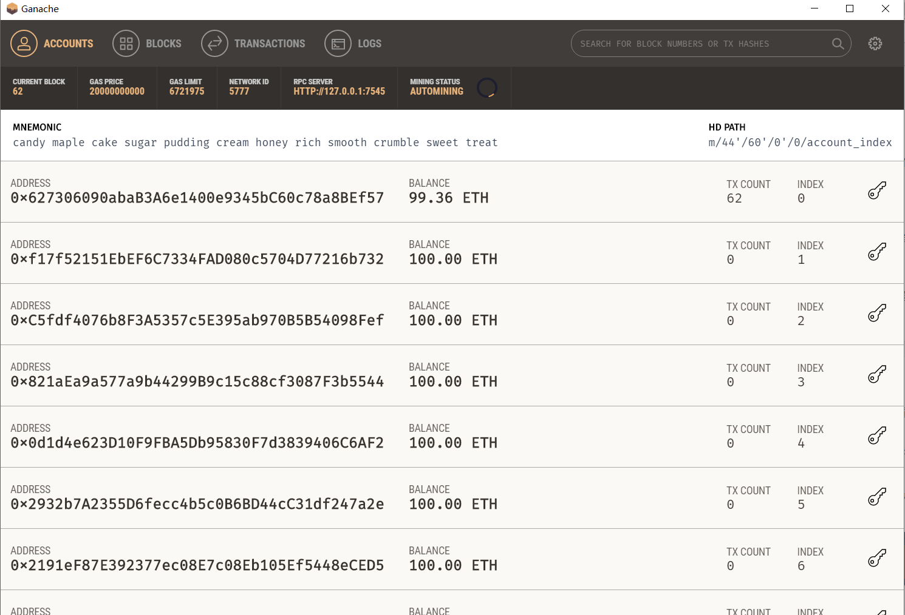
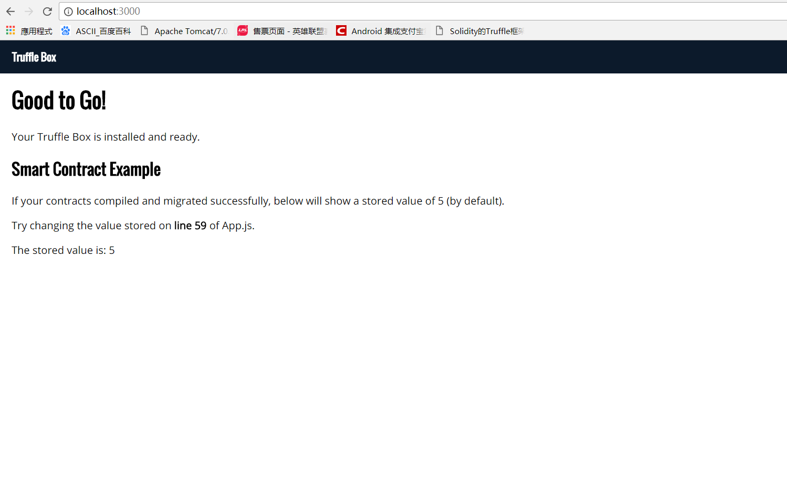

# 搭建以太坊windows环境

## 安装Truffle

> Truffle 是目前以太坊上开发智能合约的流行javascript框架,使用它能很方便的创建调用,管理智能合约

### windows 环境安装

>#### 编译工具推荐,vs code
>
>vs code 插件推荐 Solidity Extended ,这个插件相对比起vs code 插件库里的其他插件相对好用
>
>#### 安装truffle,需要node.js 5.0以上的版本
>npm install -g truffle
>

### 创建您的第一个truffle 项目

>#### 使用Truffle Boxes创建于运行您的智能合约项目，安装Truffle Boxes
>truffle box 有几个版本可以选择，笔者这里选择的是react boxes
>>http://truffleframework.com/boxes/
>
> truffle unbox react
>
> 运行命令等待安装完成，安装完成后可以看到下面的项目结构
>

### 运行您的truffle 应用
> 需要使用一个truffle 的客户端,这里推荐大家使用Ganache
>http://truffleframework.com/ganache/
>
> 安装以后运行起来,其中这些ETH账户都是虚拟的。
>
>在vs code 中打开终端运行命令
>
>truffle compile
>
>truffle migrate
>
>运行truffle migrate 会报错
>Error: No network specified. Cannot determine current network.
>在您的truffle.js 里的module.exports添加下面代码

```networks: {
    development: {
        host: "127.0.0.1",
        port: 7545,
        network_id: "*" // 匹配任何network id
     }
```
>
>接下来在您项目目录下的src/utils/getWeb3.js 中找到第24行将URL地址路径换成您自己客户端的地址路径
>
>var provider = new Web3.providers.HttpProvider('http://127.0.0.1:7545')
>
> 运行您的项目
>
> npm run start
>
> 看到下面截图说明运行成功
>
>
> 注意: 如果The stored value is: 不是5 请在 src/utils/getWeb3.js 中找到第24行正确配置您的ETH 客户端地址
>
> 关于windows 环境搭建就到这里,下一章将编写智能合约获取客户端里的所有ETH账户，完成转账等功能。
>源代码在Chapter_1文件夹下面,下载后 请使用npm i 安装node model
>
> truffle 官方网站 http://truffleframework.com/