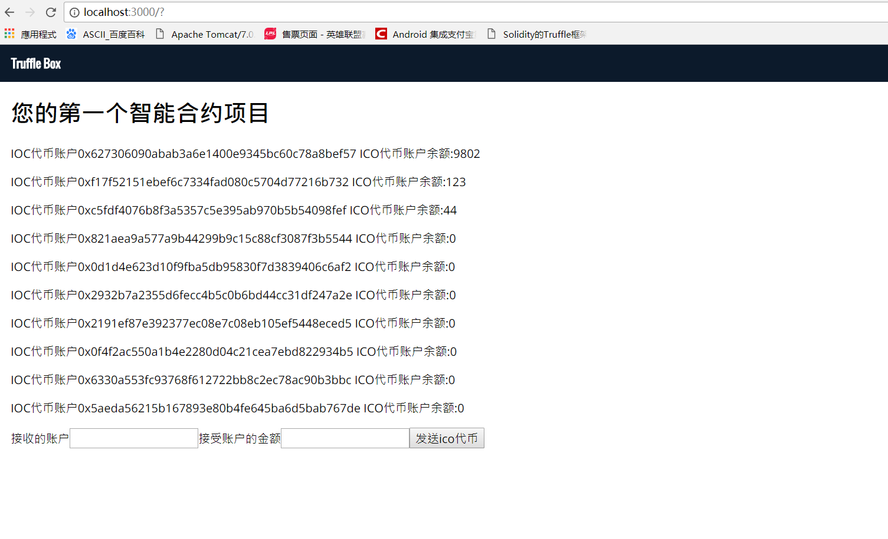

# 完成您的第一个智能合约编写

## 需要了解的知识

> ETH 账户分为外部账户和合约账户，外部账户为ETH的公共账户，合约账户为当前智能合约的账户，他们的关系在部署的合约里是一一对应的，在下面代码里将展示创建合约账户，初始化机构账户，为机构账户分配1000个余额，完成机构账户对非机构账户的转账

## 项目结构说明

>contracts 目录为您自己编写的智能合约
>
>migrations 为需要编译链接的智能合约描述
>
>其他结构为标准的react 项目结构

## 编写第一个智能合约

>在contracts 文件夹下面新建文件MetaCoin.sol与ConvertLib.sol
>
> MataCoin 实现的功能: 映射代币账户，初始化机构账户10000个代币，发送代币从机构到其他账户
>
> MetaCoin.sol 代码如下:

```pragma solidity ^0.4.0;
import "./ConvertLib.sol";

// This is just a simple example of a coin-like contract.
// It is not standards compatible and cannot be expected to talk to other
// coin/token contracts. If you want to create a standards-compliant
// token, see: https://github.com/ConsenSys/Tokens. Cheers!

contract MetaCoin {
	//将以太坊账户映射到代币账户
	mapping (address => uint) balances;

	function MetaCoin() public {
		balances[tx.origin] = 10000;
	}

	function sendCoin(address receiver, uint amount) public returns(bool sufficient) {
		if (balances[msg.sender] < amount) return false;
		balances[msg.sender] -= amount;
		balances[receiver] += amount;
		return true;
	}

	function getBalanceInEth(address addr) public returns(uint){
		return ConvertLib.convert(getBalance(addr),2);
	}

	function getBalance(address addr) public returns(uint){
  	return balances[addr];
	}
}
```

> ConvertLib.sol 代码如下:

```
pragma solidity ^0.4.0;

library ConvertLib{
	function convert(uint amount,uint conversionRate) public returns (uint convertedAmount)
	{
		return amount * conversionRate;
	}
}
```
> 在migrations 下面 2_deploy_contracts.js文件里新增如下代码:
```
var SimpleStorage = artifacts.require("./SimpleStorage.sol");
var MetaCoin = artifacts.require("./MetaCoin.sol");
var ConvertLib = artifacts.require("./ConvertLib.sol");

module.exports = function(deployer) {
  deployer.deploy(ConvertLib)
  deployer.link(ConvertLib,MetaCoin)
  deployer.deploy(MetaCoin)
  deployer.deploy(SimpleStorage);
};

```

> 运行命令 truffle complie
>
> 运行命令 truffle migrate

## 编写javascript 代码实现对代币账户的管理

> App.js 实现的功能:获取账户余额,对非机构账户的账户转入代币
>
> 打开src/App.js 文件,替换以下代码:
```
import React, { Component } from 'react'
import MetaCoinContract from '../build/contracts/MetaCoin.json'
import getWeb3 from './utils/getWeb3'

import './css/oswald.css'
import './css/open-sans.css'
import './css/pure-min.css'
import './App.css'

class App extends Component {
  constructor(props) {
    super(props)

    this.state = {
      web3: null,
      accounts: [],
      coinbaseAccount : ''
    }

    this._getAccountBalance = this._getAccountBalance.bind(this)
   
  }

  componentWillMount() {

    getWeb3
      .then(results => {
        this.setState({
          web3: results.web3
        })
        this.instantiateContract()
      })
      .catch(() => {
        console.log('Error finding web3.')
      })
  }

  /**
   * 初始化您的智能合约
   */
  instantiateContract() {
    const contract = require('truffle-contract')
    const metaCoin = contract(MetaCoinContract)
    metaCoin.setProvider(this.state.web3.currentProvider)
    metaCoin.deployed().then((instance) => {
      this.setState({metaCoin:instance})

      this.refreshBalances()
    })

  }

  /**
   * 刷新账户余额
   */
  refreshBalances(){
    this.state.web3.eth.getAccounts((error, accounts) => {
        var accountsAndBalances = accounts.map(account=>{
          return this._getAccountBalance(account).then((balance) => { return { account, balance } })
        })
        Promise.all(accountsAndBalances).then((accountsAndBalances) => {
          this.setState({accounts: accountsAndBalances, coinbaseAccount: accountsAndBalances[0]})
        })
    })
  }

  /**
   * 获取账户余额
   * @param {*账户} account 
   */
  _getAccountBalance (account) {
    var meta = this.state.metaCoin
    return new Promise((resolve, reject) => {
      meta.getBalance.call(account, {from: account}).then(function (value) {
        resolve({ account: value.valueOf() })
      }).catch(function (e) {
        console.log(e)
        reject()
      })
    })
  }

  handleSendMeta(e){
    e.preventDefault()
    console.log(`Recipient Address: ${this.recipientAddressInput.value}`)
    console.log(`send amount: ${this.sendAmountInput.value}`)


    this.state.metaCoin.sendCoin(this.recipientAddressInput.value.trim(),this.sendAmountInput.value.trim(), {from: this.state.coinbaseAccount.account}).then(function() {
      this.refreshBalances()
      console.log('SENT')
    }.bind(this)).catch(function(e) {
      console.log(e);
    });
  }

  render() {
    return (
      <div className="App">
        <nav className="navbar pure-menu pure-menu-horizontal">
          <a href="#" className="pure-menu-heading pure-menu-link">Truffle Box</a>
        </nav>
        <main className="container">
          <div className="pure-g">
            <div className="pure-u-1-1">
              <h1>您的第一个智能合约项目</h1>
              {this.state.accounts.map(({account, balance}) =>
                <p>IOC代币账户{account}   ICO代币账户余额:{balance.account}</p>
                )}
            </div>
          </div>
          <form>
              <label>接收的账户</label>
              <input id="recipient_address" type="text"  ref={(i)=>{ if(i) { this.recipientAddressInput = i}}} ></input>
              <label>接受账户的金额</label>
              <input id='send_amount' type="text" ref={(i) => { if(i) { this.sendAmountInput = i}}}></input>
              <button onClick={this.handleSendMeta.bind(this)}>发送ico代币</button>
            </form>
        </main>
        
      </div>
    );
  }
}

export default App

```

> 完成后可以看到如下截图:
>
>
> 输入需要转入的地址，输入代币，就可以对相应的账户转入代币，注意:第一个账户是机构账户,没有完成转入转出地址的校验。
>
> 源代码在Chapter_2文件夹下面,下载后 请使用npm i 安装node model
>
> truffle 官方网站 http://truffleframework.com/
>
>[下一章](./Chapter_3.md)