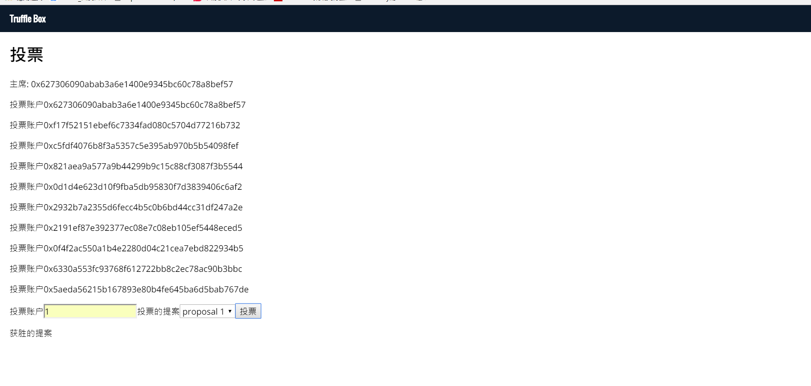

# 编写投票合约

## 业务场景

> 这是一个关于投票的合约列子为官方列子，但是没有前端如何调用，我们将编写前端如何调用，完整的实现整个业务
>
> 官方地址:https://solidity.readthedocs.io/en/develop/solidity-by-example.html

## 编写投票的智能合约

> 在 contracts 下新建文件名:Ballot.sol,粘贴以下代码

```
pragma solidity ^0.4.2;

//投票的智能合约
contract Ballot {

    // 一个Voter结构代表一个选民
    struct Voter{
        uint weight; //票的权重
        bool voted; //是否投票
        address delegate; //选民的hash地址
        uint vote;  //投票提案的索引
    }

    // 一个提案
    struct Proposal{
        bytes32 name; //提案的名称
        uint voteCount; //累计投票数
    }

    //主席地址
    address public chairperson;

    //将以太坊账户映射为合约账户
    mapping(address => Voter) public voters;

    //提案的集合
    Proposal[] public proposals;

    //由主席创建投票提案
    function Ballot(bytes32[] proposalNames) public {
        chairperson = msg.sender;
        voters[chairperson].weight = 1;

        for (uint i = 0; i < proposalNames.length; i++) {
            proposals.push(Proposal({
                name: proposalNames[i],
                voteCount:0
            }));
        }
    }

    //给选民投票权，只能由主席调用
    function giveRightToVote(address voter) public{
          require((msg.sender == chairperson) && !voters[voter].voted && (voters[voter].weight == 0));
          voters[voter].weight = 1;
    }

    //委托他人投票
    function delegate(address to) public {
        Voter storage sender =  voters[msg.sender];
        require(!sender.voted);
        require(to != msg.sender);

        while(voters[to].delegate != address(0)){
            to = voters[to].delegate;
            require(to != msg.sender);
        }

        sender.voted = true;
        sender.delegate = to;
        Voter storage delegate = voters[to];
        if(delegate.voted){
            proposals[delegate.vote].voteCount += sender.weight;
        }
        else{
            delegate.weight += sender.weight;
        }
    }

    //给提案投票
    function vote(uint proposal) public {
        Voter storage sender = voters[msg.sender];
        require(!sender.voted);
        sender.voted = true;
        sender.vote = proposal;

        proposals[proposal].voteCount += sender.weight;
    }

    //计算获胜的提案
    function winningProposal() public view returns(uint winningProposal){
        uint winningVoteCount = 0;
        for (uint p = 0; p < proposals.length; p++) {
            if(proposals[p].voteCount > winningVoteCount){
                winningVoteCount = proposals[p].voteCount;
                winningProposal = p;
            }
        }
    }

    function winnerName() public view returns (bytes32 winnerName) {
        winnerName = proposals[winningProposal()].name;
    }

}
```

> 在APP.js 中粘贴一下代码:

```
import React, { Component } from 'react'
import BallotContract from '../build/contracts/Ballot.json'
import getWeb3 from './utils/getWeb3'

import './css/oswald.css'
import './css/open-sans.css'
import './css/pure-min.css'
import './App.css'

/**
* @author   作者:  qugang
* @E-mail   邮箱: qgass@163.com
* @date     创建时间：2017/12/23
* 类说明     投票的实现
*/


class App extends Component {
  constructor(props) {
    super(props)

    this.state = {
      web3: null,
      accounts: [],
      coinbaseAccount: '',
      selectValue: '',
      winValue: '',
      error:''
    }

  }

  componentWillMount() {

    getWeb3
      .then(results => {
        this.setState({
          web3: results.web3
        })
        this.instantiateContract()
      })
      .catch(() => {
        console.log('Error finding web3.')
      })
  }

  /**
   * 初始化您的智能合约
   */
  instantiateContract() {
    const contract = require('truffle-contract')
    const ballot = contract(BallotContract)
    ballot.setProvider(this.state.web3.currentProvider)
    this.state.web3.eth.getAccounts((error, accounts) => {
      this.setState({ accounts: accounts, coinbaseAccount: accounts[0] })
      ballot.deployed().then((instance) => {
        this.setState({ ballot: instance })
      })
    })

  }

  /**
   * 刷新获胜投票提案
   */
  refreshVote() {
    this.state.ballot.winnerName().then(function(value){

      this.setState({
        winValue: this.state.web3.toAscii(value.valueOf())
      })
    }.bind(this)).catch(function(e){
      console.log(e);
    });
  }

  handleSendBallot(e) {
    e.preventDefault()
    console.log(`Recipient Address: ${this.recipientAddressInput.value}`)
    this.state.ballot.vote(this.state.selectValue, { from: this.recipientAddressInput.value }).then(function () {
      this.refreshVote()
      console.log('SENT')
    }.bind(this)).catch(function (e) {
      console.log(e);
    });
  }

  handleChange(e) {
    this.setState({ selectValue: e.target.value })
  }

  render() {
    return (
      <div className="App">
        <nav className="navbar pure-menu pure-menu-horizontal">
          <a href="#" className="pure-menu-heading pure-menu-link">Truffle Box</a>
        </nav>
        <main className="container">
          <div className="pure-g">
            <div className="pure-u-1-1">
              <h1>投票</h1>
              <p>主席: {this.state.coinbaseAccount}</p>
              {this.state.accounts.map((account) =>
                <p>投票账户{account} </p>
              )}
            </div>
          </div>

          <form>
            <label>投票账户</label>
            <input id="recipient_address" type="text" ref={(i) => { if (i) { this.recipientAddressInput = i } }} ></input>
            <label>投票的提案</label>
            <select value={this.state.selectValue} onChange={this.handleChange.bind(this)}>
              <option value="0">proposal 1</option>
              <option value="1">proposal 2</option>
              <option value="2">proposal 3</option>
            </select>
            <button onClick={this.handleSendBallot.bind(this)}>投票</button>
          </form>
          <p>获胜的提案{this.state.winValue}</p>
        </main>

      </div>
    );
  }
}

export default App

```

> 在 migrations 里的 2_deploy_contracts.js 中粘贴以下代码:

```
var Ballot = artifacts.require("./Ballot.sol");

module.exports = function(deployer) {
  deployer.deploy(Ballot,["proposal 1","proposal 2","proposal 3"],{from:"0x627306090abaB3A6e1400e9345bC60c78a8BEf57"});
};

```

> 因为truffle 只能在发布的时候才能调用构造函数，所以主席和提案需要在这里添加
>
> 运行命令 truffle compile
>
> 运行命令 truffle migrate
>
> 完成后会看到以下截图:
>
>
>
> 选择地址就可以投票了，请注意查看日志出现：Error: VM Exception while processing transaction: revert
说明这个账户已经投过票了。
>
>[下一章](./Chapter_3.md)